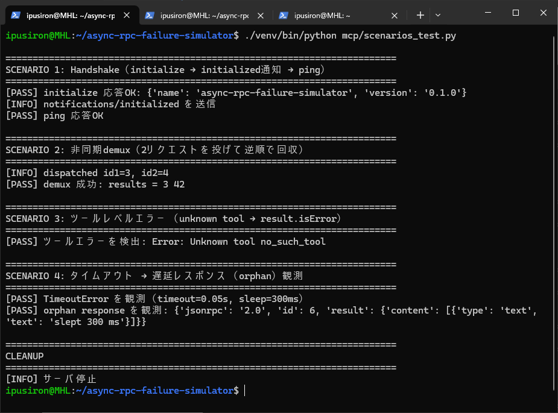
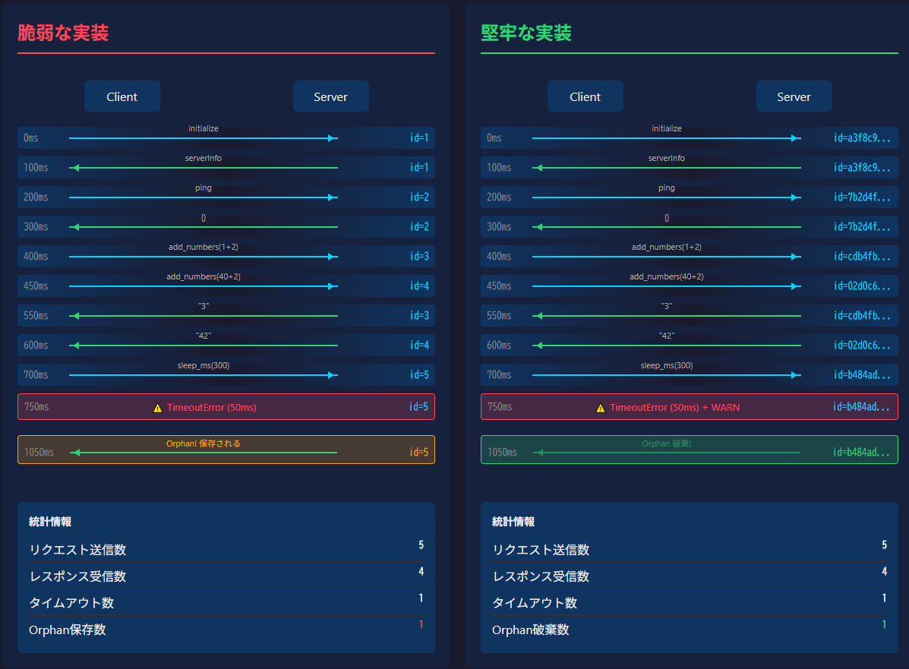
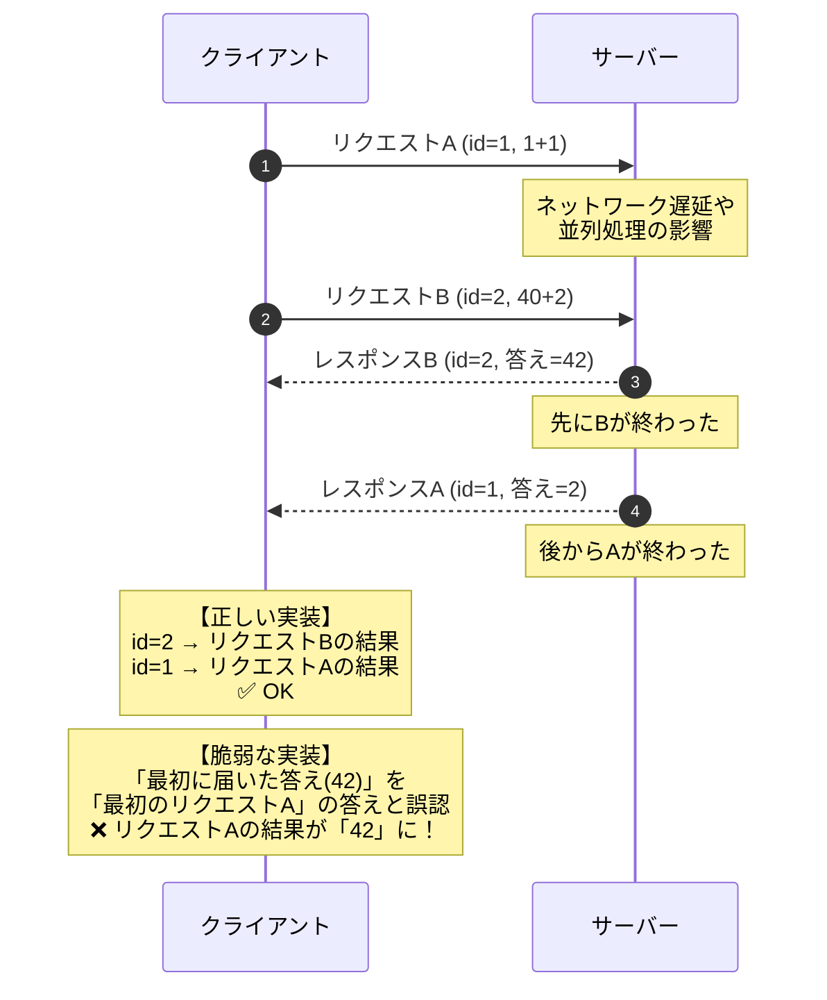
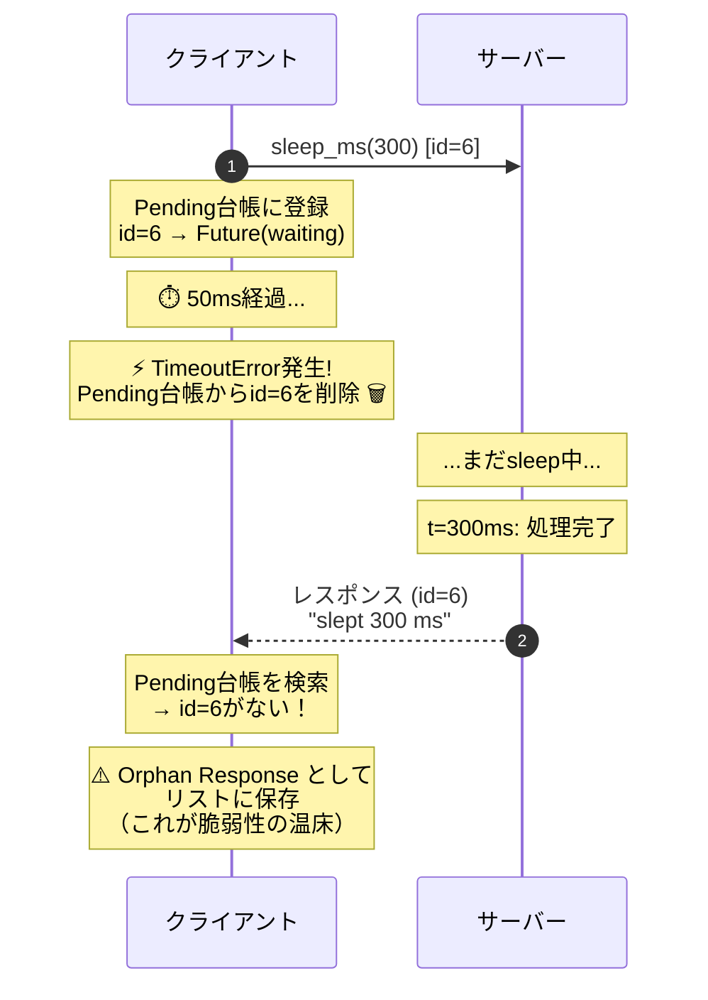
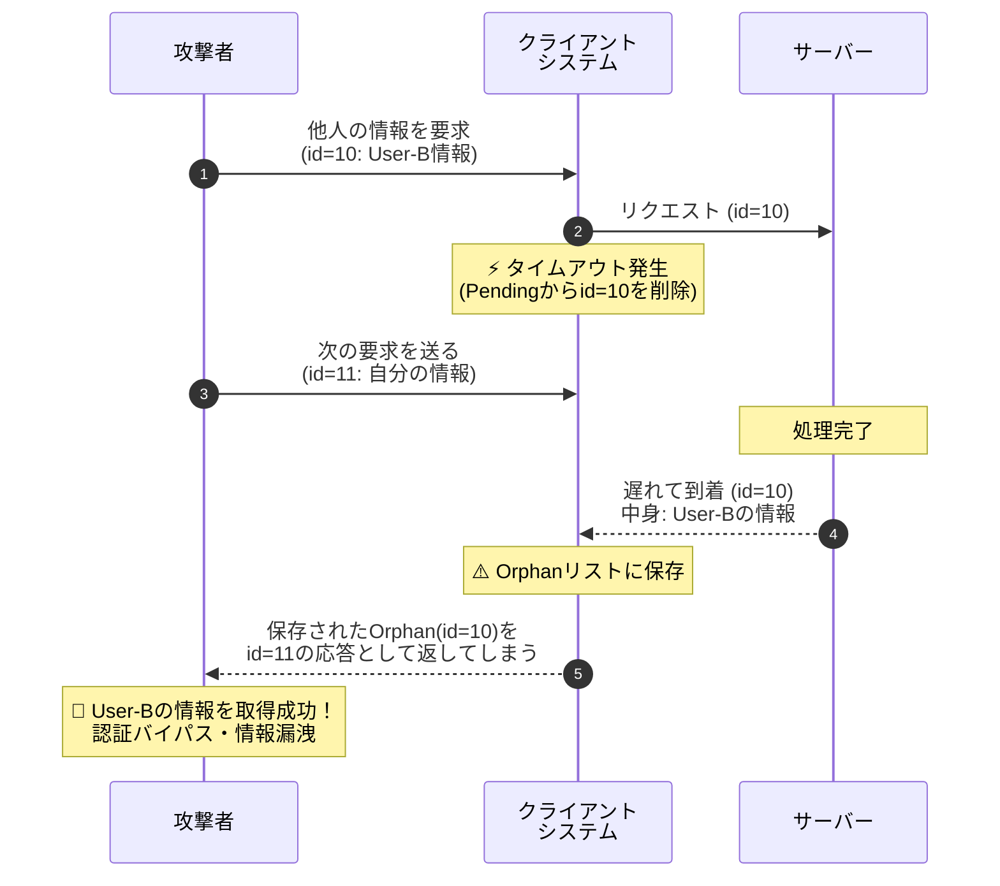
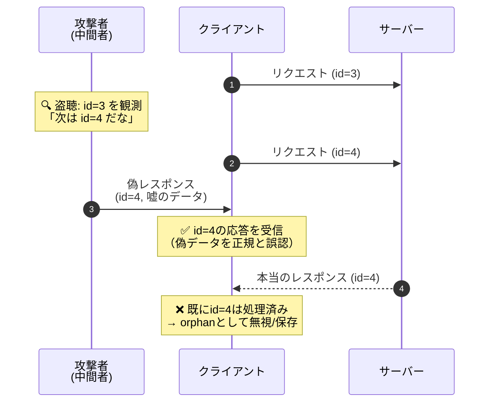
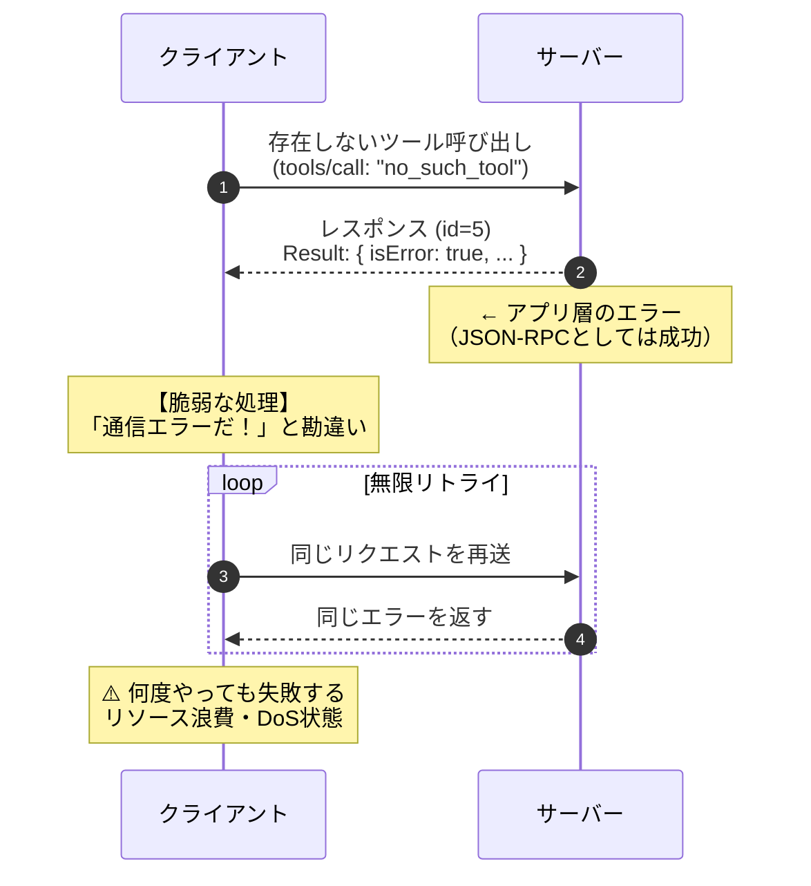

<!--
---
id: day112
slug: async-rpc-failure-simulator

title: "Async RPC Failure Simulator"

subtitle_ja: "非同期RPCにおける設計誤りの再現シミュレーター"
subtitle_en: "Failure Mode Simulator for Asynchronous RPC Designs"

description_ja: "非同期RPCにおけるタイムアウト・遅延レスポンス（orphan）・ID取り違えといった設計上の失敗モードを再現・観測する教育用シミュレーター。"
description_en: "An educational simulator that reproduces and observes failure modes in asynchronous RPC designs, including timeouts, orphan responses, and request/response mismatches."

category_ja:
  - 設計ミス可視化
  - 非同期セキュリティ
category_en:
  - Design Failure Visualization
  - Asynchronous Security

difficulty: 4

tags:
  - async
  - rpc
  - mcp
  - timeout
  - orphan-response
  - demultiplex
  - security-design

repo_url: "https://github.com/ipusiron/async-rpc-failure-simulator"

hub: true
---
-->

# Async RPC Failure Simulator – 非同期RPCにおける設計誤りの再現シミュレーター

[](https://github.com/ipusiron/async-rpc-failure-simulator)


**Day112 - 生成AIで作るセキュリティツール200**

**Async RPC Failure Simulator** は、非同期RPCクライアントにおいて発生しがちな**タイムアウト・遅延レスポンス（orphan response）・ID取り違え**といった設計上の失敗モードを、**再現可能な実験**として観測するためのシミュレーターです。

本リポジトリではMCP（Model Context Protocol）のstdio transportを題材にしていますが、扱っている失敗モード自体は **非同期RPC全般に共通**するものです。

---

## 何ができるか

このツールで次の現象を再現・観測できます。

- 非同期RPCにおける **request / response の順不同**
- タイムアウト後に返ってくる **遅延レスポンス（orphan response）**
- タイムアウトによるpending台帳掃除と、その副作用
- unknown toolによる **ツール層エラー（`result.isError`）**
- プロトコル層エラーとアプリ層エラーの違い

※ 攻撃ツールではありません。**設計ミスがセキュリティ事故につながる境界**を学ぶための教材です。

---

## 📸 スクリーンショット

> 
>
> *テストプログラムである"scenarios_test.py"ファイルの実行結果*

> 
>
> *Web UIで「脆弱 vs 堅牢」比較*

---

## 想定読者

- 非同期処理に不慣れなエンジニア
- MCP/Agent/Tool callingを扱う開発者
- セキュリティ初学者〜中級者
- 「攻撃ではないが危険な設計」に関心のある人

---

## 📚 つまずいたときの学習ガイド

本ツールを使ったりREADMEを読んでもピンとこない場合、以下の前提知識を順番に学ぶことをおすすめします。

### 1. 非同期処理の基礎（最重要）

本ツールの核心は「非同期」です。以下の概念を理解しましょう。

| 概念 | 説明 |
|------|------|
| 同期 vs 非同期 | 「結果を待ってから次へ進む」vs「待たずに次へ進む」 |
| Future/Promise | 「まだ届いていない結果を表すオブジェクト」 |
| タイムアウト | 「一定時間待っても結果が来なければ諦める」 |

**学習リソース:**
- Python公式: [concurrent.futures](https://docs.python.org/ja/3/library/concurrent.futures.html)
- キーワード: 「Python 非同期処理 入門」「Python Future 使い方」

### 2. クライアント・サーバーモデル

「リクエストを送って、レスポンスを受け取る」という基本パターンを理解しましょう。

```
クライアント                    サーバー
    │                             │
    ├─── リクエスト（id=1）──────→│
    │                             │
    │←────── レスポンス（id=1）───┤
    │                             │
```

**ポイント:**
- リクエストとレスポンスは `id` で対応づける
- 複数のリクエストを同時に送ると、レスポンスの順番は保証されない

**学習リソース:**
- キーワード: 「HTTPリクエスト レスポンス 仕組み」「WebSocket 入門」

### 3. マルチスレッドの基礎

本ツールでは「メインスレッド」と「readerスレッド」が同時に動きます。

| スレッド | 役割 |
|---------|------|
| メインスレッド | リクエストを送信し、結果を待つ |
| readerスレッド | サーバーからの応答を常に監視し、受信したら対応するFutureに結果をセット |

**学習リソース:**
- Python公式: [threading](https://docs.python.org/ja/3/library/threading.html)
- キーワード: 「Python スレッド 入門」「マルチスレッド 排他制御」

### 4. JSON-RPC 2.0（軽めでOK）

MCPが採用しているプロトコルです。以下だけ押さえれば十分です。

| 項目 | 説明 |
|------|------|
| `id` フィールド | リクエストとレスポンスを紐づける識別子 |
| リクエスト | `id` あり → 応答が必要 |
| 通知（notification） | `id` なし → 応答不要 |

**学習リソース:**
- [JSON-RPC 2.0 仕様](https://www.jsonrpc.org/specification)（英語だが短い）

### 5. MCP（Model Context Protocol）

本ツールが題材としているプロトコルです。AIエージェントとツール間の通信規格として注目されています。

| 概念 | 説明 |
|------|------|
| stdio transport | 標準入出力（stdin/stdout）を使った通信方式 |
| `initialize` | クライアントとサーバーの接続開始ハンドシェイク |
| `tools/call` | サーバーが提供するツールを呼び出すメソッド |
| MCP Inspector | MCPサーバーをテストするためのGUIツール |

**学習リソース:**
- [MCP公式ドキュメント](https://modelcontextprotocol.io/)
- [MCP Transport仕様（JSON-RPCとの関係）](https://modelcontextprotocol.io/specification/2025-11-25/basic/transports)
- キーワード: 「MCP Model Context Protocol 入門」「Claude MCP」

### 学習の順番

```
1. 非同期処理 ─→ 2. クライアント・サーバー ─→ 3. マルチスレッド ─→ 4. JSON-RPC ─→ 5. MCP
     ↓                    ↓                        ↓                    ↓              ↓
  Future/timeout      id で突き合わせ         readerスレッド        プロトコル基盤    本ツールの題材
```

### 本ツールで学ぶ概念

上記の前提知識を踏まえた上で、本ツールでは以下の概念を体験的に学びます。

| 用語 | 説明 |
|------|------|
| orphan response | タイムアウト後に届いた「引き取り手のない」レスポンス。クライアントが待機を諦めた後にサーバーから届くため、対応するリクエストが見つからない |
| demux（多重分離） | 複数のレスポンスをIDで正しいリクエストに振り分ける処理。順不同で届くレスポンスを取り違えないための仕組み |
| pending台帳 | 「送信済み・応答待ち」のリクエストIDとFutureを管理する辞書。タイムアウト時にここから削除されることでorphanが発生する |
| TOCTOU | Time Of Check to Time Of Use。チェック時点と使用時点の間にタイミングギャップが生じる問題 |

これらを理解すると、「なぜorphan responseが発生するのか」「なぜIDの予測可能性が危険なのか」がクリアになるはずです。

---

## 前提条件

- Python 3.9以上
- 標準ライブラリのみ使用（追加ライブラリ不要）
- MCP Inspectorを使う場合はNode.js / npx

---

## セットアップ（venv）

今回はvenvを有効化せずに、絶対パスでvenvのPythonを使います。

```
ipusiron@MHL:~/async-rpc-failure-simulator$ pwd
/home/ipusiron/async-rpc-failure-simulator
ipusiron@MHL:~/async-rpc-failure-simulator$ python3 -m venv venv
ipusiron@MHL:~/async-rpc-failure-simulator$ ls -l ./venv/bin/python
lrwxrwxrwx 1 ipusiron ipusiron 7 Jan 29 02:46 ./venv/bin/python -> python3
ipusiron@MHL:~/async-rpc-failure-simulator$ ./venv/bin/python --version
Python 3.10.12
```

venvの環境構築ではまった場合は以下の記事を参考にしてください。

-[WSL2とvenvで分離するPython開発・実験環境設計【Windows編】](https://akademeia.info/?p=48605)

---

## MCPサーバーの単体テスト

MCPサーバーは以下の仕様とします。

- stdout：何も出ない（JSON専用）
- stderr：起動ログが出る
- [Ctrl]＋[C]キーで停止

```
ipusiron@MHL:~/async-rpc-failure-simulator$ ./venv/bin/python ./mcp/demo_server.py
MCP デモサーバー起動（stdio transport）
```
MCPサーバーを実行すると起動ログ「MCP デモサーバー起動（stdio transport）」が出力します。

問題は、この出力がstdout（標準出力）ではなくstderr（標準エラー出力）に出ているかどうかでです。
stdio transportではstdoutはJSONのみが絶対ルールだからです。

これがクリアすれば、Inspector互換の第一関門クリアです。

### テスト1　＜stdoutが汚れていないかチェック＞

そこで、以下のようにstdoutを"/tmp/mcp_stdout.txt"ファイルに出力するようにします。

```
ipusiron@MHL:~/async-rpc-failure-simulator$ ./venv/bin/python ./mcp/demo_server.py > /tmp/mcp_stdout.txt
MCP デモサーバー起動（stdio transport）
^C
Traceback (most recent call last):
  File "/home/ipusiron/async-rpc-failure-simulator/./mcp/demo_server.py", line 236, in <module>
    main()
  File "/home/ipusiron/async-rpc-failure-simulator/./mcp/demo_server.py", line 218, in main
    for line in sys.stdin:
KeyboardInterrupt

ipusiron@MHL:~/async-rpc-failure-simulator$ ls -l /tmp/mcp_stdout.txt
-rw-r--r-- 1 ipusiron ipusiron 0 Jan 29 02:55 /tmp/mcp_stdout.txt
ipusiron@MHL:~/async-rpc-failure-simulator$ wc -c /tmp/mcp_stdout.txt
0 /tmp/mcp_stdout.txt
```

サーバーを止めて（あるいは別Terminalから）、"/tmp/mcp_stdout.txt"ファイルのファイル容量をチェックします。
0バイトであれば空なので、確かに起動ログは標準エラー出力に出ていると判断できます。

### テスト2　＜手動で1発疎通（ping）＞

stdioは同一プロセスのstdinに送る必要があるので、簡単にやるなら1コマンドでまとめてこうします。

stdoutだけ確認してみます。

```
ipusiron@MHL:~/async-rpc-failure-simulator$ printf '%s\n' '{"jsonrpc":"2.0","id":1,"method":"ping"}' | ./venv/bin/python mcp/demo_server.py 2>/dev/null
{"jsonrpc": "2.0", "id": 1, "result": {}}
```

stderrだけ確認してみます。

```
ipusiron@MHL:~/async-rpc-failure-simulator$ printf '%s\n' '{"jsonrpc":"2.0","id":1,"method":"ping"}' | ./venv/bin/python mcp/demo_server.py 1>/dev/null
MCP デモサーバー起動（stdio transport）
```

---

## InspectorでMCPサーバーに接続する

以下のコマンドでInspector（疑似MCPクライアント＋UI）からMCPサーバーに接続してみます。

```
ipusiron@MHL:~/async-rpc-failure-simulator$ npx -y @modelcontextprotocol/inspector@0.19.0 --   ./venv/bin/python ./mcp/demo_server.py
```

InspectorのResources/Toolsタブを確認します。

> 
>
> *InspectorのResourcesタブ*

> 
>
> *InspectorのToolsタブ*

Inspector上で以下が確認できます。

- initialize
- resources/list（空配列）
- resources/templates/list（空配列）
- tools/list
- tools/call(add_numbers)
- tools/call(sleep_ms)

Inspectorの環境構築ではまった場合は以下の記事を参考にしてください。

-[「ホストOS上のMCP Inspector操作UIページ」から「WSL上のMCPサーバー」にConnectできない問題を解決した記録](https://akademeia.info/?p=48678)

---

## 失敗モード再現テスト（本体）

"mcp/scenarios_test.py"ファイルは、失敗ケースを再現するテスト用のMCPクライアントです。

```
ipusiron@MHL:~/async-rpc-failure-simulator$ ./venv/bin/python mcp/scenarios_test.py

========================================================================
SCENARIO 1: Handshake（initialize → initialized通知 → ping）
========================================================================
[PASS] initialize 応答OK: {'name': 'async-rpc-failure-simulator', 'version': '0.1.0'}
[INFO] notifications/initialized を送信
[PASS] ping 応答OK

========================================================================
SCENARIO 2: 非同期demux（2リクエストを投げて逆順で回収）
========================================================================
[INFO] dispatched id1=3, id2=4
[PASS] demux 成功: results = 3 42

========================================================================
SCENARIO 3: ツールレベルエラー（unknown tool → result.isError）
========================================================================
[PASS] ツールエラーを検出: Error: Unknown tool no_such_tool

========================================================================
SCENARIO 4: タイムアウト → 遅延レスポンス（orphan）観測
========================================================================
[PASS] TimeoutError を観測（timeout=0.05s, sleep=300ms）
[PASS] orphan response を観測: {'jsonrpc': '2.0', 'id': 6, 'result': {'content': [{'type': 'text', 'text': 'slept 300 ms'}]}}

========================================================================
CLEANUP
========================================================================
[INFO] サーバー停止
```

### 各シナリオの詳細解説

---

#### SCENARIO 1: Handshake（MCPプロトコルの初期化シーケンス）

```
Client                              Server
  │                                    │
  ├─ initialize (id=1) ───────────────→│  ← リクエスト（idあり、応答必須）
  │                                    │
  │←─────────────── serverInfo 応答 ───┤  ← 応答（同じid=1で返る）
  │                                    │
  ├─ notifications/initialized ───────→│  ← 通知（idなし、応答不要）
  │                                    │
  ├─ ping (id=2) ─────────────────────→│  ← リクエスト
  │                                    │
  │←─────────────────────── {} 応答 ───┤  ← 応答（id=2）
  │                                    │
```

**何が起きているか:**
1. `initialize`：クライアントがサーバーに接続を開始。サーバーは`serverInfo`（名前・バージョン）を返す
2. `notifications/initialized`：クライアントが初期化完了を通知。**通知には`id`がないため、サーバーは応答しない**
3. `ping`：生存確認。空オブジェクト`{}`が返れば疎通OK

**学習ポイント:**
- JSON-RPCでは`id`があるメッセージは「リクエスト」、ないメッセージは「通知」
- 通知に応答を返すと、クライアント側で「orphan response」になる危険がある

---

#### SCENARIO 2: 非同期demux（多重化と順不同応答）

非同期通信では、リクエスト順とレスポンス順が一致するとは限りません。IDによる突き合わせ（Demux）が正しく行われないと、テレコ（取り違え）が発生します。



**脆弱な実装の実例（CVE-2020-11984等）:**
Apache mod_proxy では接続を使い回す際にレスポンスが混入し、別のユーザーに他人のレスポンスが表示される事故が発生しました。

以下はテキスト形式での図解です：

```
Client                              Server
  │                                    │
  ├─ add_numbers(1+2) [id=3] ─────────→│
  ├─ add_numbers(40+2) [id=4] ────────→│  ← 2つのリクエストを連続送信
  │                                    │
  │  （サーバーは順番に処理するが、      │
  │    ネットワーク遅延で逆転する      │
  │    可能性がある）                  │
  │                                    │
  │←─────────────────── id=3, "3" ─────┤
  │←─────────────────── id=4, "42" ────┤
  │                                    │
```

**何が起きているか:**
1. クライアントは2つのリクエストを**待たずに**連続送信（fire-and-forget）
2. サーバーは順番に処理して応答を返す
3. クライアントは**逆順（id=4を先に、id=3を後に）で結果を取得**
4. それでも`id`で突き合わせるので、結果を取り違えない

**テストコードの該当箇所:**
```python
# わざと逆順で待つ（順不同でも取り違えないことが本質）
resp2 = fut2.result(timeout=5)  # id=4 を先に待つ
resp1 = fut1.result(timeout=5)  # id=3 を後に待つ
```

**学習ポイント:**
- 非同期RPCでは応答順序は保証されない（ネットワーク遅延、サーバー内並列処理などで逆転しうる）
- **`id`による多重分離（demultiplex）が正しく実装されていないと、レスポンスの取り違え事故が起きる**
- このテストは「正しい実装なら取り違えない」ことを確認している

---

#### SCENARIO 3: ツールレベルエラー（result.isError）

```
Client                              Server
  │                                    │
  ├─ tools/call("no_such_tool") ──────→│
  │                                    │
  │←── result: {isError: true, ...} ───┤  ← JSON-RPC errorではない！
  │                                    │
```

**何が起きているか:**
1. 存在しないツール`no_such_tool`を呼び出す
2. サーバーは**JSON-RPCのerrorフィールドではなく**、`result.isError`でエラーを返す

**応答の形式:**
```json
{
  "jsonrpc": "2.0",
  "id": 5,
  "result": {
    "isError": true,
    "content": [{"type": "text", "text": "Error: Unknown tool no_such_tool"}]
  }
}
```

**学習ポイント:**
- MCPでは「ツール層エラー」と「プロトコル層エラー」を区別している
- **プロトコル層エラー**（JSON-RPCレベル）: `{"error": {"code": -32601, "message": "..."}}` の形式
- **ツール層エラー**（MCP/アプリレベル）: `{"result": {"isError": true, ...}}` の形式
- この区別を誤ると、エラーハンドリングが破綻する（例：ツールエラーをプロトコルエラーとして処理してしまう）

---

#### SCENARIO 4: タイムアウト → 遅延レスポンス（orphan）観測

これが本シミュレーターの**核心シナリオ**です。



**重要な点:**
- `t=50ms`でクライアントはIDを忘れますが、`t=300ms`でサーバーからそのIDの返事が届きます
- これを「Orphan（孤児）」と呼びます
- **脆弱な実装:** 届いたOrphanを捨てずにリストへ保存してしまうと、攻撃につながります

以下はテキスト形式での詳細な時系列です：

```
時間軸 →

Client                              Server
  │                                    │
  ├─ sleep_ms(300) [id=6] ────────────→│  t=0ms: リクエスト送信
  │                                    │
  │  [pending台帳]                     │
  │  id=6 → Future(waiting)            │
  │                                    │
  │  ... 50ms経過 ...                  │
  │                                    │
  ├─ TimeoutError発生! ─────────────── │  t=50ms: クライアント側タイムアウト
  │                                    │
  │  [pending台帳からid=6を削除]        │  ← ★ここが重要
  │  id=6 → (削除済み)                 │
  │                                    │
  │                                    │  ... サーバーはまだ sleep 中 ...
  │                                    │
  │                                    │  t=300ms: サーバー処理完了
  │←──────────── id=6, "slept 300 ms" ─┤  ← レスポンスが返ってくる
  │                                    │
  │  [pending台帳を検索]                │
  │  id=6 → 見つからない！             │
  │                                    │
  │  → orphan_responses に追加         │  ← ★ orphan response の誕生
  │                                    │
```

**何が起きているか（ステップバイステップ）:**

1. **t=0ms**: クライアントが`sleep_ms(300)`を送信。`id=6`でpending台帳に登録
2. **t=0〜50ms**: クライアントは`timeout=0.05s`で応答を待機
3. **t=50ms**: タイムアウト発生。`TimeoutError`を投げ、**pending台帳からid=6を削除**
4. **t=50〜300ms**: サーバーはまだ`sleep(300ms)`の最中。クライアントのタイムアウトを知らない
5. **t=300ms**: サーバーが処理完了。`id=6`で応答を返す
6. **t=300ms+α**: クライアントのreaderスレッドが応答を受信。しかしpending台帳に`id=6`がない
7. **結果**: この応答は**orphan（孤児）response**として`orphan_responses`リストに格納

**テストコードの該当箇所:**
```python
# readerスレッドでの処理
if fut is None:
    # 台帳にない -> orphan（タイムアウト後の遅延レスポンス等）
    self.orphan_responses.append(data)
```

**なぜこれが問題になりうるか:**
- orphan responseを**再利用・キャッシュ**すると、後続リクエストと取り違える可能性がある
- 例：id=6のorphanを、次に発行したid=7のリクエストの応答として誤認識してしまう
- これは「設計ミス」であり、正しい実装では**orphanは破棄するか、明示的にログに記録する**

---

### これは異常ではない

上記のorphan response現象は**バグではなく、非同期RPCでは設計上必ず起こり得る現象**です。

- サーバーはクライアントのタイムアウト設定を知らない
- クライアントが諦めても、サーバーは処理を続ける（キャンセル機構がない限り）
- 遅延したレスポンスは必ず返ってくる

**重要なのは、この現象を想定した設計になっているかどうか**です。

---

## 🔓 攻撃シナリオの可視化

ここまでで観測した失敗モードが、実際にどのような攻撃に発展するかをMermaid図解で示します。

### 攻撃1: Orphan Response Hijacking（レスポンス取り違え攻撃）

Orphan Responseを適切に破棄せず再利用してしまうことで発生する攻撃シナリオです。攻撃者がタイミングを操作し、別人の情報を取得します。



**攻撃の成立条件:**
- クライアントがorphan responseを破棄せずリストに保存している
- 攻撃者がタイミングを調整し、別ユーザーのレスポンスが「orphan」になるよう仕向ける
- 保存されたorphanが次のリクエストの応答として誤って返される

**リスク:** 認証バイパス、個人情報の漏洩、セッションハイジャック

---

### 攻撃2: ID予測による偽レスポンス注入

リクエストIDに連番（1, 2, 3...）を使っていると、攻撃者が次のIDを予測してサーバーになりすますことができます。



**攻撃の成立条件:**
- `self._next_id += 1` のように単純なインクリメントでIDを生成
- 攻撃者がネットワーク上でパケットを盗聴可能（中間者攻撃）
- 攻撃者のレスポンスがサーバーより先にクライアントに到達

**対策（堅牢な実装）:** `secrets.token_hex(16)` などを用いて暗号論的乱数でIDを生成し、予測不可能にする

---

### 攻撃3: ツール層エラーとプロトコル層エラーの混同

エラーの種類を取り違えることで、本来リトライすべきでないエラーをリトライしたり、その逆の対応をしてしまう設計ミスです。



**区別の重要性:**
| エラー種別 | 形式 | リトライすべきか |
|-----------|------|-----------------|
| プロトコル層（JSON-RPC）| `{"error": {"code": -32601, ...}}` | 状況による（一時的障害なら可） |
| ツール層（MCP/アプリ） | `{"result": {"isError": true, ...}}` | 基本的に不可（ロジックエラー） |

---

### セキュリティ的な示唆

| 問題パターン | リスク | 対策 |
|-------------|--------|------|
| orphan responseを再利用 | レスポンスの取り違え（認証バイパス等の可能性） | orphanは即座に破棄、または厳格なログ記録 |
| unknown-idの応答を無視しない | 攻撃者が偽のレスポンスを注入可能 | unknown-idは警告ログ＋破棄 |
| ツール層エラーをプロトコル層エラーと混同 | 適切なリトライ・フォールバック処理の失敗 | エラー種別を明確に分離 |
| タイムアウト後もリソースを保持 | DoS（リソース枯渇） | タイムアウト時に台帳から確実に削除 |

---

## 🛡️ "scenarios_test_secure.py"プログラムによる実験

### 使用ファイルの役割

| ファイル | 役割 |
|---------|------|
| `secure_client.py` | 堅牢化されたMCPクライアント実装（ライブラリ） |
| `scenarios_test_secure.py` | 堅牢な実装を使ったテストシナリオ（実行スクリプト） |

### secure_client.py のコア処理

```python
class SecureStdioMcpClient:
    """堅牢化されたMCPクライアント"""

    def _issue_id(self) -> str:
        """【堅牢化1】暗号論的乱数でIDを生成"""
        return secrets.token_hex(16)  # 128ビットの予測不可能なID

    def _reader_loop(self):
        """サーバーからのレスポンスを読み取るスレッド"""
        for line in self.process.stdout:
            data = json.loads(line)
            resp_id = data.get("id")

            with self._lock:
                fut = self._pending.get(resp_id)

            if fut is None:
                # 【堅牢化2】orphanは保存せず破棄
                self.stats["orphans_discarded"] += 1
                log_security("WARN", f"Orphan response を破棄: id={resp_id}")
                continue  # ← リストに追加しない

            fut.set_result(data)

    def request(self, method: str, params: dict, timeout: float = None) -> dict:
        """同期リクエスト（タイムアウト検証付き）"""
        # 【堅牢化3】タイムアウト範囲チェック
        if timeout < MIN_TIMEOUT:
            log_security("WARN", f"タイムアウトが短すぎます")
        elif timeout > MAX_TIMEOUT:
            log_security("WARN", f"タイムアウトが長すぎます")

        request_id, fut = self.send_request(method, params)
        try:
            return fut.result(timeout=timeout)
        finally:
            # 必ず台帳から削除（TOCTOU対策）
            with self._lock:
                self._pending.pop(request_id, None)
```

**3つの堅牢化ポイント**:
1. **`_issue_id()`**: `secrets.token_hex(16)`で予測不可能なIDを生成
2. **`_reader_loop()`**: orphan responseをリストに保存せず、ログ出力後に破棄
3. **`request()`**: タイムアウト値の範囲チェックと、`finally`での確実な台帳削除

### scenarios_test_secure.py のコア処理

```python
def scenario_timeout_orphan_secure(client: SecureStdioMcpClient):
    """SCENARIO 4: タイムアウト → orphan破棄の確認"""

    orphans_before = client.stats["orphans_discarded"]  # 破棄数を記録

    try:
        # 短いタイムアウト（0.05秒）で300ms待つツールを呼び出し
        client.request("tools/call", {
            "name": "sleep_ms",
            "arguments": {"ms": 300}
        }, timeout=0.05)
    except FutureTimeoutError:
        print("[PASS] TimeoutError を観測")

    time.sleep(0.4)  # orphanが到着するのを待つ

    orphans_after = client.stats["orphans_discarded"]

    if orphans_after > orphans_before:
        # orphanは「破棄数」としてカウントされ、リストには保存されない
        print(f"[PASS] orphan response を破棄（カウント: {orphans_before} → {orphans_after}）")
```

**脆弱な実装との違い**:
- 脆弱版: `client.orphan_responses`リストに保存 → 再利用可能で危険
- 堅牢版: `client.stats["orphans_discarded"]`でカウントのみ → 再利用不可

### 実行方法

MCPサーバーである"demo_server.py"を起動した状態で、"scenarios_test_secure.py"ファイルを以下のコマンドで実行します。
ただし、"secure_client.py"ファイルも配置しておかなければなりません。

```
ipusiron@MHL:~/async-rpc-failure-simulator$ ./venv/bin/python mcp/scenarios_test_secure.py
========================================================================
堅牢な実装（SecureStdioMcpClient）でのテスト実行
========================================================================

========================================================================
SCENARIO 1: Handshake（initialize → initialized通知 → ping）
========================================================================
[PASS] initialize 応答OK: {'name': 'async-rpc-failure-simulator', 'version': '0.1.0'}
[INFO] notifications/initialized を送信
[PASS] ping 応答OK

========================================================================
SCENARIO 2: 非同期demux（2リクエストを投げて逆順で回収）
========================================================================
[INFO] dispatched id1=cdb4fb09... id2=02d0c6e5...
[INFO] ↑ IDが暗号論的乱数（連番ではない）ことを確認
[PASS] demux 成功: results = 3 42

========================================================================
SCENARIO 3: ツールレベルエラー（unknown tool → result.isError）
========================================================================
[PASS] ツールエラーを検出: Error: Unknown tool no_such_tool

========================================================================
SCENARIO 4: タイムアウト → orphan破棄の確認（堅牢版）
========================================================================
[INFO] 脆弱な実装との違い:
       - 脆弱: orphan_responses リストに保存（再利用可能）
       - 堅牢: ログ出力して破棄（再利用不可）

[WARN] [SECURITY] タイムアウトが短すぎます: 0.05s < 0.1s
[PASS] TimeoutError を観測（timeout=0.05s, sleep=300ms）
[WARN] [SECURITY] Orphan response を破棄: id=b484ad0e0b5711d26bdcaed2676e8832
[PASS] orphan response を破棄（カウント: 0 → 1）
[INFO] 堅牢な実装では orphan はリストに保存されず、再利用できない

========================================================================
SCENARIO 5: 脆弱な実装との比較サマリー
========================================================================

┌─────────────────────────────────────────────────────────────────────┐
│ 比較項目            │ 脆弱な実装           │ 堅牢な実装            │
├─────────────────────────────────────────────────────────────────────┤
│ request_id生成      │ self._next_id += 1   │ secrets.token_hex()   │
│                     │ → 1, 2, 3...（予測可）│ → ランダム（予測不可）│
├─────────────────────────────────────────────────────────────────────┤
│ orphan response     │ orphan_responses     │ stats["orphans_       │
│                     │   .append(data)      │   discarded"] += 1    │
│                     │ → 再利用可能         │ → 破棄（再利用不可）  │
├─────────────────────────────────────────────────────────────────────┤
│ タイムアウト検証    │ なし                 │ MIN/MAX範囲チェック   │
│                     │                      │ → 範囲外は警告        │
├─────────────────────────────────────────────────────────────────────┤
│ セキュリティログ    │ なし                 │ log_security() で     │
│                     │                      │ stderr に出力         │
└─────────────────────────────────────────────────────────────────────┘

【防止できる攻撃】
1. ID予測攻撃: 連番だと攻撃者が次のIDを予測し、偽レスポンスを注入可能
   → 暗号論的乱数で予測不可能に

2. Orphan再利用攻撃: タイムアウト後のレスポンスを別リクエストに紐づけ
   → 破棄することで再利用を防止

3. タイムアウト操作DoS: 極端に長いタイムアウトでリソース占有
   → 範囲チェックで抑制


========================================================================
CLEANUP & STATISTICS
========================================================================
[INFO] サーバー停止

【統計情報】
  - リクエスト送信数:    6
  - レスポンス受信数:    5
  - タイムアウト発生数:  1
  - orphan破棄数:        1

[INFO] orphan response は保存されず、安全に破棄されました
```

### 堅牢な実装が防止するCVE・攻撃シナリオ

本セクションで紹介したCVE事例に対し、`secure_client.py`の実装がどのように防御として機能するかを詳細に解説します。

---

#### CVE-2023-44487（HTTP/2 Rapid Reset）への対策

**脆弱性の本質**: クライアントがリクエスト送信後すぐにキャンセルしても、サーバー側で非同期処理が継続しリソースを消費し続ける。

**堅牢な実装での対策**:

```python
# secure_client.py でのタイムアウト範囲チェック
if timeout < MIN_TIMEOUT:
    log_security("WARN", f"タイムアウトが短すぎます: {timeout}s < {MIN_TIMEOUT}s")
elif timeout > MAX_TIMEOUT:
    log_security("WARN", f"タイムアウトが長すぎます: {timeout}s > {MAX_TIMEOUT}s")
```

| 対策ポイント | 効果 |
|-------------|------|
| タイムアウト下限（0.1秒） | 極端に短いタイムアウトによる大量orphan生成を抑制 |
| タイムアウト上限（30秒） | 長時間リソース占有によるDoSを抑制 |
| 統計情報の記録 | `stats["timeouts"]`で異常なタイムアウト頻度を検知可能 |

**実験結果との対応**:
```
[WARN] [SECURITY] タイムアウトが短すぎます: 0.05s < 0.1s
```
→ 0.05秒という極端に短いタイムアウトに対して警告を出力。本番環境ではこの警告をアラートに接続することで、Rapid Reset的な攻撃パターンを早期検知できます。

---

#### Apache mod_proxy レスポンス混同（CVE-2020-11984等）への対策

**脆弱性の本質**: エラー処理時にバックエンド接続を適切にクローズせず、次のリクエストに前のレスポンスが紛れ込む。

**堅牢な実装での対策**:

```python
# secure_client.py でのorphan破棄
if fut is None:
    self.stats["orphans_discarded"] += 1
    log_security("WARN", f"Orphan response を破棄: id={resp_id}")
    continue  # ← 保存しない（再利用不可）
```

| 対策ポイント | 効果 |
|-------------|------|
| orphanを即座に破棄 | 「前のレスポンスが次のリクエストに紛れ込む」状況を根本的に防止 |
| 破棄時のログ出力 | 異常な頻度でorphanが発生していないか監視可能 |
| 統計カウンター | `stats["orphans_discarded"]`でorphan発生率を定量化 |

**実験結果との対応**:
```
[WARN] [SECURITY] Orphan response を破棄: id=b484ad0e0b5711d26bdcaed2676e8832
[PASS] orphan response を破棄（カウント: 0 → 1）
```
→ orphanが発生した事実を記録しつつ、再利用可能なリストには保存しない。Apache mod_proxyで問題となった「レスポンスの紛れ込み」が構造的に発生しません。

---

#### CryptoNote Wallet JSON-RPC 脆弱性への対策

**脆弱性の本質**: 予測可能なrequest_idにより、攻撃者が偽のレスポンスを注入可能。

**堅牢な実装での対策**:

```python
# secure_client.py での暗号論的乱数ID生成
def _issue_id(self) -> str:
    return secrets.token_hex(16)  # 128ビットの暗号論的乱数
```

| 対策ポイント | 効果 |
|-------------|------|
| `secrets.token_hex(16)` | 128ビット（16バイト）の暗号論的乱数で予測不可能 |
| 文字列型ID | 整数オーバーフローの心配がない |
| 衝突確率 2^-128 | 実質的にIDの重複・衝突は発生しない |

**実験結果との対応**:
```
[INFO] dispatched id1=cdb4fb09... id2=02d0c6e5...
[INFO] ↑ IDが暗号論的乱数（連番ではない）ことを確認
```
→ 連番（1, 2, 3...）ではなくランダムな16進数文字列。攻撃者が「次のIDは7だろう」と推測して偽レスポンスを注入する攻撃が不可能になります。

**脆弱な実装との比較**:
```python
# 脆弱な実装（scenarios_test.py）
[INFO] dispatched id1=3, id2=4  # ← 連番、次は5と予測可能

# 堅牢な実装（scenarios_test_secure.py）
[INFO] dispatched id1=cdb4fb09... id2=02d0c6e5...  # ← 予測不可能
```

---

#### Juniper Junos RPC Race Condition（CVE-2016-1267）への対策

**脆弱性の本質**: 権限チェックと実際の操作の間にタイミングギャップがあり、その間に状態を変更可能（TOCTOU攻撃）。

**堅牢な実装での対策**:

```python
# secure_client.py でのpending台帳管理
def request(self, method: str, params: dict, timeout: float = None) -> dict:
    ...
    try:
        return fut.result(timeout=timeout)
    except FutureTimeoutError:
        self.stats["timeouts"] += 1
        raise
    finally:
        with self._lock:
            self._pending.pop(request_id, None)  # ← 必ず台帳から削除
```

| 対策ポイント | 効果 |
|-------------|------|
| `finally`ブロックでの確実な削除 | 例外発生時も台帳から確実に削除 |
| ロック（`self._lock`）の使用 | 複数スレッドからの同時アクセスでも整合性を維持 |
| タイムアウト時の即座の削除 | 「宙に浮いた状態」の時間を最小化 |

**TOCTOU攻撃への耐性**:
- 脆弱な実装: タイムアウト後もpending台帳にIDが残る可能性 → 攻撃者がそのIDで偽レスポンスを送る余地
- 堅牢な実装: タイムアウト即座に台帳から削除 → 攻撃のタイミングウィンドウを最小化

---

#### Orange Tsai's Confusion Attacks への対策

**脆弱性の本質**: コンポーネント間でセマンティクス（意味の解釈）が異なり、認証バイパスに悪用される。

**堅牢な実装での対策**:

```python
# secure_client.py でのセキュリティログ分離
def log_security(level: str, msg: str):
    """セキュリティ関連のログ出力"""
    print(f"[{level}] [SECURITY] {msg}", file=sys.stderr)
```

| 対策ポイント | 効果 |
|-------------|------|
| セキュリティログの分離 | 通常ログとセキュリティイベントを区別 |
| stderr への出力 | stdout（JSON専用）を汚染しない |
| 明確なプレフィックス `[SECURITY]` | ログ解析時にセキュリティイベントを抽出しやすい |

**Confusion Attacks防止の観点**:
- 「どの層で何が起きたか」を明確にログに残すことで、セマンティクスの混同を検知可能
- 例: orphan発生 → プロトコル層の問題、ツールエラー → アプリ層の問題、と区別できる

---

#### 対策効果のまとめ

| CVE/攻撃シナリオ | 脆弱な実装での問題 | 堅牢な実装での対策 | 実験での確認 |
|-----------------|-------------------|-------------------|-------------|
| HTTP/2 Rapid Reset | タイムアウト制限なし | MIN/MAX範囲チェック | `[WARN] タイムアウトが短すぎます` |
| Apache mod_proxy mixup | orphanをリストに保存 | orphanを即座に破棄 | `orphan破棄数: 1` |
| CryptoNote ID予測 | 連番ID（1,2,3...） | 暗号論的乱数ID | `id1=cdb4fb09...` |
| Juniper TOCTOU | 台帳削除が不確実 | finally + lock | 統計情報で追跡可能 |
| Confusion Attacks | ログ分離なし | `[SECURITY]`プレフィックス | stderrに分離出力 |

---

## ⚠️ 設計ミスが引き起こす問題

本シミュレーターで再現した失敗モードは、実際のシステムでどのような問題を引き起こすのでしょうか。性能・運用・セキュリティの3つの観点から解説します。

### 性能への影響

| 設計ミス | 問題 | 具体例 |
|---------|------|--------|
| タイムアウト後もpending台帳を保持 | **メモリーリーク** | 長時間運用でpending台帳が肥大化し、OOM（Out of Memory）でクラッシュ |
| orphan responseを無限にバッファリング | **メモリー枯渇** | 遅延レスポンスを捨てずに溜め込み続けてヒープ領域を圧迫 |
| 同期的にレスポンスを待つ設計 | **スループット低下** | 1リクエストごとに待機するため、並列性が活かせない |
| demux処理のロック競合 | **レイテンシ増大** | 複数スレッドがpending台帳にアクセスする際のロック待ち |

### 運用トラブル

| 設計ミス | 問題 | 具体例 |
|---------|------|--------|
| orphan responseのログ出力がない | **障害原因の特定困難** | 「なぜかレスポンスが返ってこない」という報告に対し、原因がタイムアウトなのか通信エラーなのか判別できない |
| エラー種別（プロトコル層/ツール層）の混同 | **誤ったリトライ処理** | ツールエラー（業務ロジック失敗）をプロトコルエラー（一時的な障害）と誤認してリトライし続ける |
| request_idの重複・枯渇 | **レスポンス取り違え** | 32bit整数のIDがオーバーフローして過去のIDと衝突 |
| サーバー側キャンセル機構の欠如 | **リソース浪費** | クライアントがタイムアウトしてもサーバーは処理を続行し、CPU・DBコネクションを無駄に消費 |

### セキュリティリスク（最重要）

| 設計ミス | 攻撃シナリオ | 影響度 |
|---------|-------------|--------|
| **orphan responseの再利用** | 攻撃者がタイミングを調整し、別ユーザーのレスポンスを自分のリクエストに紐づける | **Critical** - 認証バイパス、情報漏洩 |
| **unknown-idレスポンスの受け入れ** | 攻撃者が偽のレスポンス（任意のid）を注入し、クライアントに誤った結果を返させる | **High** - データ改ざん、ロジック操作 |
| **予測可能なrequest_id** | 連番や時刻ベースのIDを推測し、中間者攻撃でレスポンスを差し替え | **High** - セッションハイジャック |
| **エラーメッセージの過剰な情報開示** | ツールエラーにスタックトレースや内部パスを含めてしまう | **Medium** - 情報収集の足がかり |
| **タイムアウト値の外部制御** | ユーザー入力でタイムアウトを極端に長く設定させ、リソースを占有 | **Medium** - DoS |

### 実際のインシデント例（架空シナリオ）

```
【状況】
- MCPベースのAIエージェントが、外部APIを呼び出すツールを実装
- タイムアウト後のorphan responseを「キャッシュ」として再利用する設計

【攻撃】
1. 攻撃者Aが「ユーザーBの個人情報を取得」リクエストを送信
2. サーバーが処理中、攻撃者Aはタイムアウトを発生させる
3. orphan response（ユーザーBの個人情報）がキャッシュに残る
4. 攻撃者Aが次のリクエストを送信
5. キャッシュからorphan responseが返され、ユーザーBの情報を取得

【根本原因】
- orphan responseを破棄せず再利用した設計ミス
- request_idとユーザーセッションの紐づけが不十分
```

### 正しい設計指針

| 原則 | 実装方法 |
|------|----------|
| **orphanは即座に破棄** | 台帳にないIDのレスポンスはログ出力後に捨てる |
| **request_idは暗号論的乱数** | UUID v4やCSPRNGで生成し、予測不可能にする |
| **タイムアウトは固定値** | 外部入力でタイムアウト値を変更させない |
| **エラー種別を明確に分離** | プロトコルエラーはリトライ、ツールエラーはユーザーに通知 |
| **キャンセル機構の実装** | クライアントタイムアウト時にサーバーにキャンセル通知を送る |

---

### 脆弱な実装 vs 堅牢な実装（コード比較）

本リポジトリには「脆弱な実装」と「堅牢な実装」の両方が含まれています。

#### 実行方法

```bash
# 脆弱な実装（失敗モードを観測）
./venv/bin/python mcp/scenarios_test.py

# 堅牢な実装（正しい設計を確認）
./venv/bin/python mcp/scenarios_test_secure.py
```

#### コード差分

| 観点 | 脆弱な実装（`scenarios_test.py`） | 堅牢な実装（`secure_client.py`） |
|------|----------------------------------|----------------------------------|
| **request_id生成** | `self._next_id += 1`（連番） | `secrets.token_hex(16)`（暗号論的乱数） |
| **orphan response** | `self.orphan_responses.append(data)`（保存） | `stats["orphans_discarded"] += 1`（破棄） |
| **タイムアウト** | 引数をそのまま使用 | 範囲チェック（MIN/MAX外は警告） |
| **統計情報** | なし | `get_stats()`で取得可能 |

#### ID生成の比較

```python
# 脆弱な実装（scenarios_test.py:87-90）
def _issue_id(self) -> int:
    with self._lock:
        self._next_id += 1
        return self._next_id  # → 1, 2, 3...（予測可能）

# 堅牢な実装（secure_client.py）
def _issue_id(self) -> str:
    return secrets.token_hex(16)  # → "a3f8c9e1..."（予測不可能）
```

#### orphan処理の比較

```python
# 脆弱な実装（scenarios_test.py:120-123）
if fut is None:
    # 台帳にない -> orphan（タイムアウト後の遅延レスポンス等）
    self.orphan_responses.append(data)  # ← 保存（再利用可能で危険）
    continue

# 堅牢な実装（secure_client.py）
if fut is None:
    self.stats["orphans_discarded"] += 1
    log_security("WARN", f"Orphan response を破棄: id={resp_id}")
    continue  # ← 保存しない（再利用不可）
```

#### 堅牢な実装の出力例

```
========================================================================
SCENARIO 2: 非同期demux（2リクエストを投げて逆順で回収）
========================================================================
[INFO] dispatched id1=a3f8c9e1... id2=7b2d4f0a...
[INFO] ↑ IDが暗号論的乱数（連番ではない）ことを確認
[PASS] demux 成功: results = 3 42

========================================================================
SCENARIO 4: タイムアウト → orphan破棄の確認（堅牢版）
========================================================================
[WARN] [SECURITY] タイムアウトが短すぎます: 0.05s < 0.1s
[PASS] TimeoutError を観測（timeout=0.05s, sleep=300ms）
[WARN] [SECURITY] Orphan response を破棄: id=f9c2e8a1b7d34f6e...
[PASS] orphan response を破棄（カウント: 0 → 1）
[INFO] 堅牢な実装では orphan はリストに保存されず、再利用できない

========================================================================
CLEANUP & STATISTICS
========================================================================
【統計情報】
  - リクエスト送信数:    6
  - レスポンス受信数:    5
  - タイムアウト発生数:  1
  - orphan破棄数:        1
```

---

### 実際のセキュリティ事例・CVE

本シミュレーターで扱う失敗モードは、実際のプロダクトで深刻な脆弱性として報告されています。

#### 1. HTTP/2 Rapid Reset Attack（CVE-2023-44487）

**関連する失敗モード**: ストリーム多重化（demux）とリソース管理

| 項目 | 内容 |
|------|------|
| **CVSS** | 7.5（High） |
| **影響** | Google, Cloudflare, AWSなど主要クラウドで**史上最大規模のDDoS攻撃**に悪用 |
| **原因** | HTTP/2のストリームリセット機能を悪用。クライアントがリクエストを送信後すぐにキャンセル（RST_STREAM）を送ると、サーバー側では「ストリームはクローズ済み」と判断するが、**バックエンドでは非同期処理が継続**。これを大量に繰り返すことでリソース枯渇 |
| **本シミュレーターとの関連** | SCENARIO 4の「タイムアウト後もサーバーは処理を続ける」現象と同じ構造 |

> 参考: [Cloudflare - HTTP/2 Rapid Reset Attack](https://blog.cloudflare.com/technical-breakdown-http2-rapid-reset-ddos-attack/)

---

#### 2. Apache mod_proxy レスポンス混同（CVE-2020-11984等）

**関連する失敗モード**: レスポンスの取り違え（demux失敗）

| 項目 | 内容 |
|------|------|
| **影響** | Apacheリバースプロキシ経由で**別ユーザーのレスポンスが返される**情報漏洩 |
| **原因** | `mod_proxy_ajp`および`mod_proxy_http`がエラー処理時にバックエンド接続を適切にクローズせず、**次のリクエストに前のレスポンスが紛れ込む** |
| **本シミュレーターとの関連** | SCENARIO 2の「IDによるdemuxが正しく実装されていないとレスポンス取り違え」の実例 |

> 参考: [Apache HTTP Server 2.4 vulnerabilities](https://httpd.apache.org/security/vulnerabilities_24.html)

---

#### 3. Bugzilla JSON-RPC CSRF（CVE-2012-0440）

**関連する失敗モード**: JSON-RPCのセキュリティ設計

| 項目 | 内容 |
|------|------|
| **影響** | 認証済みユーザーのブラウザ経由で**任意のJSON-RPC APIを実行可能**。管理者権限奪取やセキュリティバグへのアクセス |
| **原因** | JSON-RPCエンドポイントがCSRFトークンチェックをバイパス可能だった。`Content-Type: application/json`の強制がなく、通常のフォーム送信で攻撃可能 |
| **本シミュレーターとの関連** | SCENARIO 3の「プロトコル層とツール層のエラー混同」—認証・認可チェックの層が曖昧だと悪用される |

> 参考: [Bugzilla Bug 718319](https://bugzilla.mozilla.org/show_bug.cgi?id=718319)

---

#### 4. Juniper Junos RPC Race Condition（CVE-2016-1267）

**関連する失敗モード**: 非同期処理のレースコンディション

| 項目 | 内容 |
|------|------|
| **影響** | 認証済みユーザーが**任意のファイルの所有権を奪取**し、root権限昇格 |
| **原因** | RPCにおける「lazy race condition」—権限チェックと実際の操作の間にタイミングギャップがあり、その間に状態を変更可能 |
| **本シミュレーターとの関連** | タイムアウトとorphan responseの間に「宙に浮いた状態」が生まれる問題と同様の時間差攻撃 |

> 参考: [Juniper Security Bulletin JSA10730](https://kb.juniper.net/InfoCenter/index?page=content&id=JSA10730)

---

#### 5. CryptoNote Wallet JSON-RPC 認証なし脆弱性

**関連する失敗モード**: JSON-RPCの認証設計

| 項目 | 内容 |
|------|------|
| **影響** | 暗号通貨ウォレットから**資金を窃取**可能 |
| **原因** | JSON-RPCサーバーがlocalhost上で認証なしで起動。ユーザーが悪意あるWebページを開くと、ブラウザ経由でウォレットAPIが呼び出される（DNS Rebinding / CSRF） |
| **本シミュレーターとの関連** | MCPサーバーも「stdioだから安全」と思い込みがちだが、プロセス間通信の経路によっては攻撃対象になりうる |

> 参考: [CryptoNote Unauthenticated JSON-RPC](https://www.ayrx.me/cryptonote-unauthenticated-json-rpc/)

---

#### 6. Orange Tsai's Confusion Attacks（2024年Black Hat発表）

**関連する失敗モード**: セマンティクスの混同

| 項目 | 内容 |
|------|------|
| **影響** | Apache HTTP Serverで**アクセス制御・認証バイパス、ファイルシステム全体へのアクセス、XSSからRCEへの昇格** |
| **原因** | `r->filename`の解釈がモジュールによって異なる（ファイルパス vs URL）。この**セマンティクスの不整合**が認証バイパスに直結 |
| **本シミュレーターとの関連** | SCENARIO 3の「ツール層エラーとプロトコル層エラーの混同」—層ごとのセマンティクスが曖昧だと、想定外の経路で機能が呼び出される |

> 参考: [Confusion Attacks - Orange Tsai](https://blog.orange.tw/posts/2024-08-confusion-attacks-en/)

---

#### まとめ：なぜこれらの脆弱性は生まれたか

| 根本原因 | 該当CVE/事例 |
|---------|-------------|
| 非同期処理でリソースのライフサイクル管理が不十分 | HTTP/2 Rapid Reset |
| レスポンスとリクエストの紐づけ（demux）が不完全 | Apache mod_proxy mixup |
| 認証・認可チェックの層が曖昧 | Bugzilla JSON-RPC CSRF, CryptoNote |
| 時間差（TOCTOU）を考慮していない | Juniper RPC race condition |
| コンポーネント間のセマンティクス不整合 | Confusion Attacks |

**これらはすべて「設計段階での考慮漏れ」が原因であり、本シミュレーターはそれを事前に体験するためのツールです。**

---

## 🌐 Web UIで視覚的に理解する

ブラウザ上で脆弱な実装と堅牢な実装の違いを視覚的に確認できるWeb UIを提供しています。

> **注意**: このWeb UIは**シミュレーション（疑似実行）**です。実際のMCPサーバーやテストプログラムは実行せず、JavaScriptで事前定義されたシナリオデータをアニメーション表示しています。実際の通信を確認したい場合は、CLIで`scenarios_test.py`または`scenarios_test_secure.py`を実行してください。

### 起動方法

```bash
./venv/bin/python web/server.py
```

ブラウザで `http://localhost:8080` が自動的に開きます。

### 画面構成

```
┌─────────────────────────────────────────────────────────────────────┐
│                  Async RPC Failure Simulator                        │
│             非同期RPCの失敗モードを視覚的に理解する                    │
├─────────────────────────────────────────────────────────────────────┤
│  [脆弱な実装を実行]    [堅牢な実装を実行]    [クリア]                  │
├─────────────────────────────────────────────────────────────────────┤
│                                                                     │
│   脆弱な実装                    │    堅牢な実装                      │
│  ┌─────────────────────────┐   │   ┌─────────────────────────┐    │
│  │ Client      Server     │   │   │ Client      Server     │    │
│  │   │           │        │   │   │   │           │        │    │
│  │   ├──request──→│ id=1   │   │   │   ├──request──→│ id=a3f8│    │
│  │   │←─response──┤        │   │   │   │←─response──┤        │    │
│  │   │           │        │   │   │   │           │        │    │
│  │   ├──request──→│ id=5   │   │   │   ├──request──→│ id=b484│    │
│  │   │  TIMEOUT! │        │   │   │   │  TIMEOUT! │        │    │
│  │   │←─ORPHAN───┤ 保存!  │   │   │   │←─ORPHAN───┤ 破棄!  │    │
│  └─────────────────────────┘   │   └─────────────────────────┘    │
│                                                                     │
│  統計: orphan保存数: 1 (危険)  │   統計: orphan破棄数: 1 (安全)     │
│                                                                     │
└─────────────────────────────────────────────────────────────────────┘
```

### 視覚化される要素

| 要素 | 色 | 説明 |
|-----|-----|------|
| リクエスト | 青（→） | クライアントからサーバーへの送信 |
| レスポンス | 緑（←） | サーバーからクライアントへの応答 |
| タイムアウト | 赤 | クライアント側でのタイムアウト発生 |
| Orphan（脆弱） | オレンジ | タイムアウト後の遅延レスポンス（保存される） |
| Orphan（堅牢） | 緑 | タイムアウト後の遅延レスポンス（破棄される） |

### 使い方

1. **サーバー起動**: `./venv/bin/python web/server.py` を実行
2. **ブラウザで開く**: 自動的に `http://localhost:8080` が開く（開かない場合は手動で）
3. **実行ボタンをクリック**: 「脆弱な実装を実行」または「堅牢な実装を実行」
4. **アニメーションを観察**: リクエスト→レスポンスの流れが時系列で表示される
5. **統計情報を確認**: 実行完了後、下部に統計が表示される
6. **両方を比較**: 両方実行して左右を見比べる

### 画面の見方

```
┌────────────────────────────────────────────────────────────────┐
│ 0ms    ├──initialize──→         id=1          │ ← 時刻とID     │
│        │      ↑                   ↑           │                │
│        │   ラベル（メソッド名）  リクエストID  │                │
├────────────────────────────────────────────────────────────────┤
│ 100ms  │←──serverInfo──┤         id=1          │ ← レスポンス   │
│        │      ↑                               │                │
│        │   矢印が逆向き（←）= サーバーからの応答  │                │
├────────────────────────────────────────────────────────────────┤
│ 750ms  │  ⚠️ TimeoutError (50ms)              │ ← タイムアウト │
│        │      ↑                               │                │
│        │   赤背景 = クライアント側で待機を諦めた │                │
├────────────────────────────────────────────────────────────────┤
│ 1050ms │←─Orphan! 保存される─┤    id=5        │ ← orphan発生   │
│        │      ↑                               │                │
│        │   オレンジ = 危険（脆弱な実装）        │                │
│        │   緑 = 安全（堅牢な実装で破棄）        │                │
└────────────────────────────────────────────────────────────────┘
```

### 注目すべき違い

| 観察ポイント | 脆弱な実装 | 堅牢な実装 | 意味 |
|-------------|-----------|-----------|------|
| **request_id** | `id=1`, `id=2`, `id=3`... | `id=a3f8c9...`, `id=7b2d4f...` | 連番は予測可能で危険 |
| **orphanの色** | オレンジ（警告色） | 緑（安全色） | 保存 vs 破棄の違い |
| **orphanのラベル** | 「保存される」 | 「破棄!」 | 再利用可能かどうか |
| **統計の表示** | `orphan保存数: 1`（赤字） | `orphan破棄数: 1`（緑字） | 危険 vs 安全 |

### Web UIを使った学習ステップ

#### ステップ1: まず脆弱な実装を観察

1. 「脆弱な実装を実行」をクリック
2. IDが `1, 2, 3...` と連番になっていることを確認
3. 最後にオレンジ色の「Orphan! 保存される」が表示されることを確認
4. 統計で「orphan保存数: 1」が赤字で表示されることを確認

**気づくべきこと**:
- 攻撃者は「次のIDは6だ」と予測できる
- orphanがリストに保存され、後で再利用される可能性がある

#### ステップ2: 堅牢な実装と比較

1. 「堅牢な実装を実行」をクリック
2. IDが `a3f8c9...`, `7b2d4f...` とランダムになっていることを確認
3. 最後に緑色の「Orphan 破棄!」が表示されることを確認
4. 統計で「orphan破棄数: 1」が緑字で表示されることを確認

**気づくべきこと**:
- 攻撃者は次のIDを予測できない
- orphanは破棄され、再利用できない

#### ステップ3: 左右を見比べて違いを言語化

両方の実行結果を並べて、以下の質問に答えてみてください：

1. **なぜ連番IDは危険か？**
   → 攻撃者が次のIDを予測し、偽のレスポンスを注入できるから

2. **なぜorphanを保存すると危険か？**
   → 後続のリクエストに誤って紐づけられ、情報漏洩につながるから

3. **堅牢な実装は何を変えたか？**
   → ID生成を暗号論的乱数に、orphanを保存ではなく破棄に

### よくある質問

**Q: 実際のMCPサーバーと通信しているの？**

A: **いいえ、していません。** Web UIは完全なシミュレーション（疑似実行）です。

| 項目 | Web UI | CLIテスト |
|------|--------|----------|
| MCPサーバー起動 | しない | する |
| 実際の通信 | しない | する |
| データソース | JavaScript内の固定データ | 実際のリクエスト/レスポンス |
| 用途 | 概念の視覚的理解 | 実際の動作確認 |

実際の通信を確認したい場合：
```bash
# 脆弱な実装（実際に通信する）
./venv/bin/python mcp/scenarios_test.py

# 堅牢な実装（実際に通信する）
./venv/bin/python mcp/scenarios_test_secure.py
```

**Q: ポート8080が使えない場合は？**

A: 別のポートを指定できます：
```bash
./venv/bin/python web/server.py 8081
```

**Q: 自分のシナリオを追加できる？**

A: `web/index.html` 内の `scenarios` オブジェクトを編集することで、カスタムシナリオを追加できます。

---

## 🎯 CTF形式の攻撃体験チャレンジ

本ツールには、学んだ知識を実践するためのCTF（Capture The Flag）形式のチャレンジが含まれています。

### Challenge 1: Orphan Response Hijacking

**難易度**: ★★☆☆☆（初級〜中級）

**シナリオ**:
あなたはセキュリティ研究者です。とある企業の内部システムで使われているMCPサーバーに脆弱性があるという報告を受けました。このサーバーには複数のユーザーがアクセスしており、各ユーザーの秘密情報を管理しています。あなたは「guest」ユーザーとしてアクセスできますが、「admin」ユーザーの秘密情報（FLAG）を取得することが目標です。

**目標**:
```
admin ユーザーの秘密情報（FLAG{...}）を取得せよ
```

**難易度選択**:
| モード | 説明 |
|--------|------|
| 🟢 Easy | ソースコード参照OK、穴埋めテンプレート使用 |
| 🟡 Normal | ソースコードは見ない、挙動から攻撃を構築（実践的） |
| 🔴 Hard | ヒントなし、完全自力で偵察→分析→攻撃 |

**学習できること**:
- orphan responseとは何か
- なぜorphanを保存すると危険か
- タイミング攻撃の基本
- 対策方法（orphan破棄、暗号論的乱数ID）
- ブラックボックステストでの脆弱性発見手法（Normal/Hardモード）

**ファイル構成**:
```
challenges/challenge1_orphan_hijack/
├── README.md              # 詳細な説明書
├── vulnerable_server.py   # 攻撃対象の脆弱なサーバー
├── exploit_template.py    # 穴埋め式の攻撃スクリプト（Easyモード用）
├── hint1.txt              # ヒント1：攻撃の方向性
├── hint2.txt              # ヒント2：具体的なテクニック
├── hint_blackbox.txt      # ブラックボックス攻撃の手法（Normal/Hardモード用）
└── solution.py            # 模範解答（最後の手段）
```

**実行方法**:

```bash
# ターミナル1: 脆弱なサーバーを起動
cd challenges/challenge1_orphan_hijack
../../venv/bin/python vulnerable_server.py

# ターミナル2: 攻撃スクリプトを編集・実行
cd challenges/challenge1_orphan_hijack
# exploit_template.py を編集して攻撃を完成させる
../../venv/bin/python exploit_template.py
```

**攻撃成功時の出力例**:
```
============================================================
Challenge 1: Orphan Response Hijacking - 模範解答
============================================================

[*] ステップ1: guest としてログイン
[+] ログイン成功

[*] ステップ2: admin の活動をトリガー
[Admin] ログイン完了
[Admin] 秘密情報を取得中（2秒の遅延あり）...
[Admin] 待ちきれない！接続切断

[*] ステップ3: orphan が発生するのを待機中...

[*] ステップ4: orphan response を取得
[*] 取得した orphan 数: 1

[*] ステップ5: FLAG を抽出

============================================================
[+] FLAG 発見: FLAG{0rph4n_r3sp0ns3_h1j4ck3d_succ3ssfully}
============================================================

おめでとうございます！攻撃成功です。
```

---

## 📁 ディレクトリ構造

```
async-rpc-failure-simulator/
├── README.md                      # 本ドキュメント
├── CLAUDE.md                      # Claude Code向けガイド
├── LICENSE                        # MITライセンス
├── .gitignore
├── .nojekyll                      # GitHub Pages用（Jekyll無効化）
│
├── mcp/                           # MCP実装（本体）
│   ├── demo_server.py             #   MCPサーバー（stdio transport、Inspector互換）
│   ├── scenarios_test.py          #   失敗モード再現テスト（脆弱な実装）
│   ├── secure_client.py           #   堅牢なクライアント実装
│   └── scenarios_test_secure.py   #   堅牢版テストシナリオ
│
├── web/                           # Web UI（視覚化ツール）
│   ├── index.html                 #   メインページ（HTML/CSS/JS）
│   └── server.py                  #   Webサーバー（標準ライブラリのみ）
│
├── challenges/                    # CTF形式の攻撃体験チャレンジ
│   └── challenge1_orphan_hijack/  #   Challenge 1: Orphan Response Hijacking
│       ├── README.md              #     詳細な説明書
│       ├── vulnerable_server.py   #     攻撃対象の脆弱なサーバー
│       ├── exploit_template.py    #     穴埋め式の攻撃スクリプト（Easyモード）
│       ├── hint1.txt              #     ヒント1：攻撃の方向性
│       ├── hint2.txt              #     ヒント2：具体的なテクニック
│       ├── hint_blackbox.txt      #     ブラックボックス攻撃の手法
│       └── solution.py            #     模範解答
│
└── assets/                        # ドキュメント用画像
    ├── screenshot.png             #   テスト実行結果
    ├── inspector_demo_server.png
    └── inspector_demo_server2.png
```

---

## 📄 ライセンス

- ソースコードのライセンスは `LICENSE` ファイルを参照してください。

---

## 🛠️ このツールについて

本ツールは、「生成AIで作るセキュリティツール200」プロジェクトの一環として開発されました。
このプロジェクトでは、AIの支援を活用しながら、セキュリティに関連するさまざまなツールを200日間にわたり制作・公開していく取り組みを行っています。

プロジェクトの詳細や他のツールについては、以下のページをご覧ください。

🔗 [https://akademeia.info/?page_id=44607](https://akademeia.info/?page_id=44607)